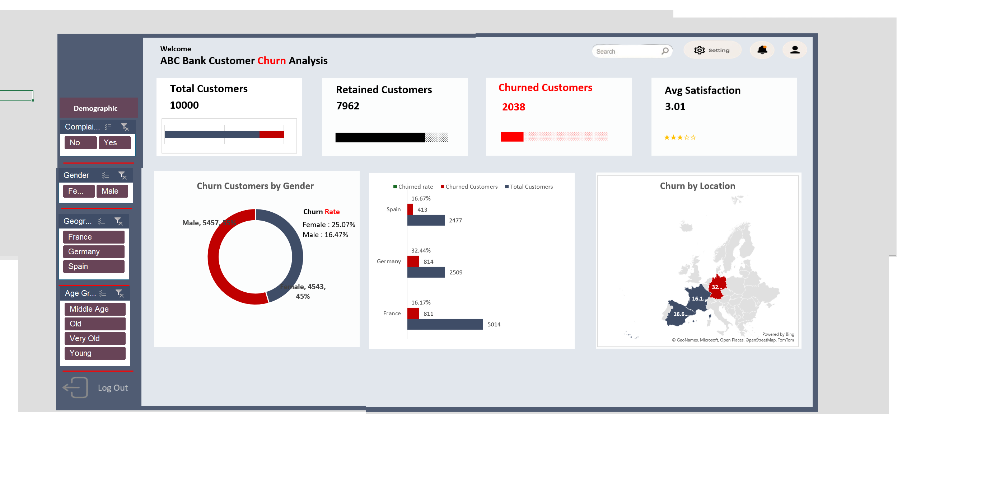
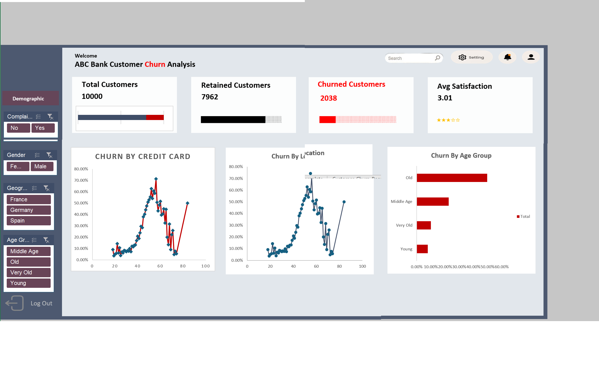
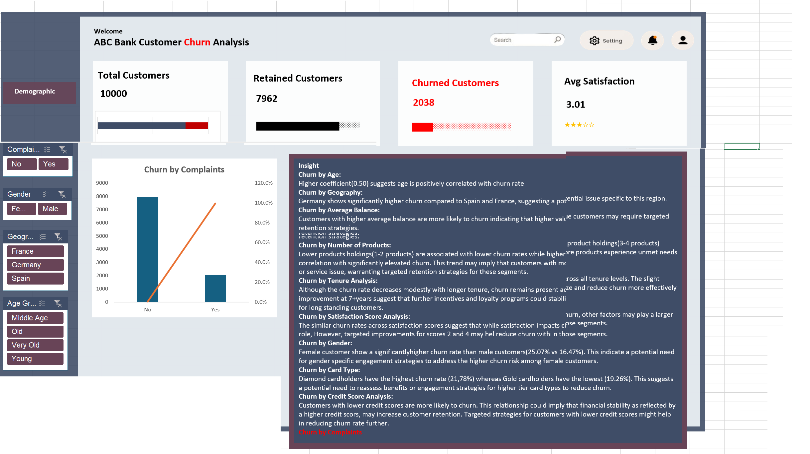

# abc-bank-churn-analysis
Customer Churn Analysis | Excel | Power Query | DAX | Banking Analytics — Identifying churn patterns and retention strategies using customer behavior and satisfaction data.


# 🏦 ABC Bank Churn Analysis  
## 🏬 Microsoft Excel & Power Tools Analytics Project

---

## 🪄 Introduction
This project analyzes a **bank customer churn dataset** using **Microsoft Excel, Power Query, and Excel Power Tools** to uncover actionable insights that support **customer retention, satisfaction improvement, and strategic decision-making** in the financial services sector.

The analysis simulates a real-world business scenario at **ABC Bank Plc**, demonstrating how data analytics enables leadership to identify churn drivers, protect high-value customers, and improve long-term profitability.

---

## 📊 Badges


---

## 📑 Table of Contents
- [Business Context](#-business-context)
- [Purpose of the Project](#-purpose-of-the-project)
- [Dataset Description](#-dataset-description)
- [Methodology (CRISP-DM)](#-methodology-crisp-dm)
- [Data Cleaning & Preparation](#-data-cleaning--preparation)
- [Key KPIs & Metrics](#-key-kpis--metrics)
- [Executive Dashboard](#-executive-dashboard)
- [Key Insights](#-key-insights)
- [Strategic Recommendations](#-strategic-recommendations)
- [Tools & Technologies](#-tools--technologies)
- [Repository Structure](#-repository-structure)
- [Conclusion](#-conclusion)
- [Author](#-author)

---

## 🧭 Business Context
ABC Bank operates in a highly competitive financial services environment where retaining customers is critical. Recent increases in customer churn raised concerns around revenue leakage, declining engagement, and loss of high-value clients.

---

## 🎯 Purpose of the Project
The primary goal is to identify **who is churning, why they are churning, and how churn can be reduced** using data-driven insights.

---

## 🗂️ Dataset Description
- **Raw Dataset:**  
👉 [Bank Churn Dataset](raw/bank%20churn%20Analysis.xlsx)

- **Processed Dataset:**  
👉 [Cleaned & Modeled Data](processed/solution.xlsx)

Fields include demographics, financial attributes, engagement behavior, satisfaction scores, complaints, and churn status.

---

## 🔍 Methodology (CRISP-DM)
1. Business Understanding  
2. Data Understanding  
3. Data Preparation  
4. Modeling  
5. Evaluation  
6. Deployment  

---

## 🧹 Data Cleaning & Preparation
- Age grouping using Excel formulas
- Data validation and enrichment via Power Query
- Measures created using Excel Data Model & DAX

---

## 📌 Key KPIs & Metrics
- Churn Rate
- Retention Rate
- Churn by Geography
- Churn by Age, Gender, Credit Score
- Product Holding vs Churn
- Satisfaction & Complaints Impact

---

## 📈 Executive Dashboard

### Dashboard Preview





---

## 📊 Executive Presentation
👉 [Download Recommendation Slides](slides/recommendation.pptx)

---

## 💡 Key Insights
- Higher churn among older customers
- Germany shows significantly higher churn
- High-balance customers churn more
- Female customers churn more than male customers
- Diamond cardholders show the highest churn rate

---

## 🧠 Strategic Recommendations
1. Target high-value customers with loyalty incentives  
2. Address regional churn issues  
3. Simplify multi-product customer experience  
4. Improve engagement for premium cardholders  
5. Introduce proactive churn-risk monitoring  

---

## 🧰 Tools & Technologies
- Microsoft Excel  
- Power Query  
- Excel Data Model & Pivot Tables  
- DAX  

---

## 📁 Repository Structure
```text
abc-bank-churn-analysis/
│
├── raw/
│   └── bank churn Analysis.xlsx
│
├── processed/
│   └── solution.xlsx
│
├── dashboard/
│   ├── pics_1.png
│   ├── pics_2.png
│   ├── pics_3.png
│   ├── pics_4.png
│   └── pics_5.png
│
├── slides/
│   └── recommendation.pptx
│
├── README.md
└── LICENSE
```

---

## 🏁 Conclusion
This project demonstrates how Excel-based analytics can deliver enterprise-grade insights into customer churn, helping banks reduce attrition, protect revenue, and strengthen customer loyalty.

---

## 👩‍💻 Author
**Charles Walton**  
Data Analyst | Business Intelligence | Financial Analytics  
📧 cwalton1335@gmail.com

